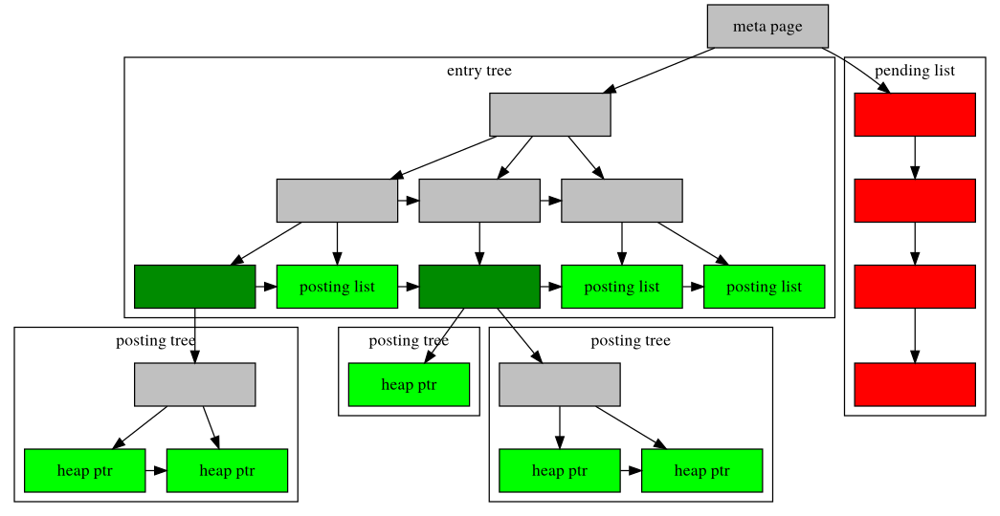

# 66.4. 實作說明

在內部，GIN 索引包含在索引鍵上建構的 B-tree 索引，其中每個索引鍵是一個或多個索引項目（例如，陣列的成員）元素，並且葉結點頁面中的每個 tuple 包含指向 heap 指標的 B-tree（“posting tree”）或 heap 指標的簡易列表（“posting list”），其列表足夠小以能與其索引鍵值放進單個索引 tuple。

從 PostgreSQL 9.1 開始，null 索引鍵值可以包含在索引中。此外，placeholder null 值也包含在索引項目中，該索引項目根據 extractValue 的結果判斷為 null 或不包含任何鍵值。這可以進行空項目的搜索。

透過在複合值（欄位號碼，鍵值）上建構單個 B-tree 來實現多欄位 GIN 索引。不同欄位的鍵值可以是不同型別。

#### &#x20;**Figure 66.1. GIN Internals**

## 64.4.1. GIN 快速更新技術

由於反向索引的固有特性，更新 GIN 索引往往會很慢：插入或更新一個 heap 資料列會導致許多項目插入到索引中（每個索引鍵從索引項目中提取一個）。從 PostgreSQL 8.4 開始，GIN 能夠透過將新的 tuple 插入臨時的未排序待處理條目列表來延遲大部分工作。當資料表被清理或自動分析時，或者當呼叫 gin\_clean\_pending\_list 函數時，又或者待處理列表變得大於 [gin\_pending\_list\_limit](../../server-administration/server-configuration/client-connection-defaults.md#gin\_pending\_list\_limit-integer) 時，使用在初始索引建立期間使用的相同批次插入技術將項目移動到主要的 GIN 資料結構。這大大提升了 GIN 索引更新速度，甚至可以計算額外的清理開銷。此外，額外的工作可以通過背景程序而不是前端查詢處理來完成。

這種方法的主要缺點是除了搜尋一般索引之外，還必須掃描待處理項目列表，因此大量待處理項目將顯著拖慢搜尋速度。另一個缺點是，雖然大多數更新都很快，但是導致待處理列表變得「太大」的更新將導致觸發立即性清理工作，因此比其他更新慢得多。正確使用 autovacuum 可以儘可能地減少這些問題。

如果一致回應時間比更新速度更重要，則可以透過關閉 GIN 索引的 fastupdate 儲存參數來停用待處理項目的使用。有關詳細訊息，請參閱 [CREATE INDEX](../../reference/sql-commands/create-index.md)。

## 64.4.2. Partial Match Algorithm

GIN** **可以支援「部分匹配」查詢，其中查詢不確定一個或多個索引鍵能完全匹配，但可能的匹配屬於相當窄的索引鍵值範圍（以比較支持法確定的索引鍵排序順序））。 extractQuery 方法不是回傳要精確匹配的索引鍵值，而是回傳某鍵值，該鍵值是搜尋範圍的下限，並將 pmatch 標示設定為 true。然後使用 comparePartial 方法掃描關鍵的範圍。comparePartial 讓能匹配的索引鍵回傳零，對於仍在搜尋範圍內的非匹配小於零，或者如果索引鍵超出可匹配的範圍則大於零。
